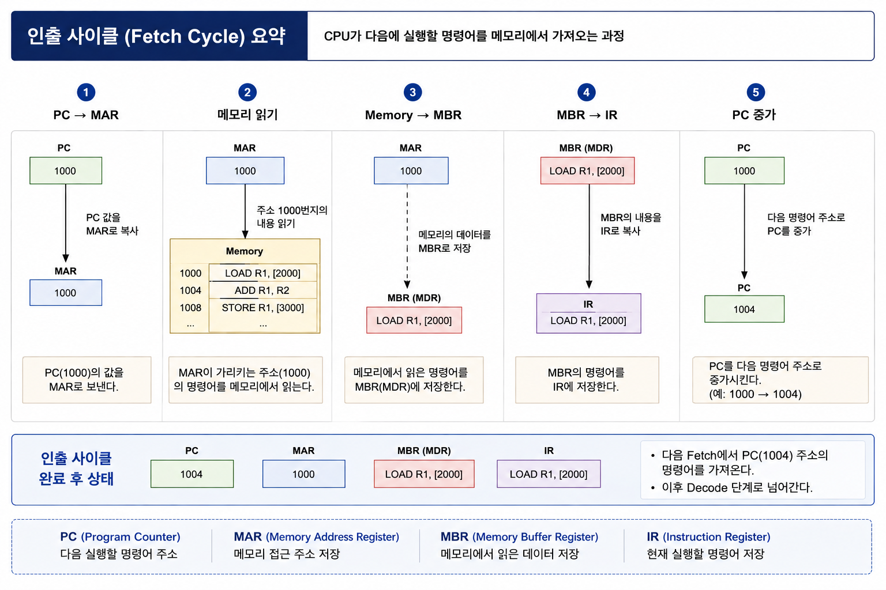

# 인출 사이클(Fetch Cycle)

- CPU가 다음에 실행할 명령어를 메모리에서 가져오는 과정

- 명령어 사이클의 첫 단계

### 인출 사이클에 사용되는 레지스터

- Program Counter, PC

	> 다음에 실행할 명령어 주소

- Memory Address Register, MAR

	> 메모리 접근 주소 저장

- Memory Buffer Register, MBR/MDR

	> 메모리에서 읽어온 데이터 저장

- Instruction Register, IR

	> 현재 실행할 명령어 저장

### 정리

